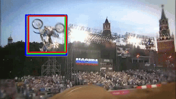
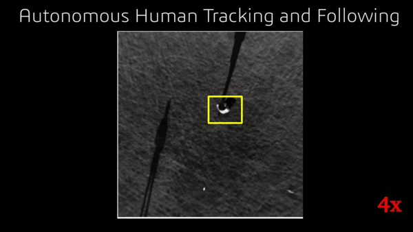

Kernelized Correlation Filters GPU
====================================
A correlation filters and deep learning based object tracking algorithm. The algorithm is implemented on the GPU using CUDA C++. 

------------

Requirements
------------
- [ROS Indigo or higher](http://wiki.ros.org/kinetic)
- [CUDA (7.5 or higher)](https://developer.nvidia.com/cuda-downloads)
- [OpenCV 3.0 or higher](https://github.com/opencv/opencv)
- [image_view](https://github.com/ros-perception/image_pipeline)
- [Caffe](https://github.com/BVLC/caffe) 
- [C++11](https://en.wikipedia.org/wiki/C%2B%2B11)

Downloading the Package
------------
```bash
$ git clone https://github.com/iKrishneel/kernelized_correlation_filters_gpu.git
$ cd kernelized_correlation_filters_gpu
$ git pull --all
```

Compilation
------------
The package is a ROS node and can be complied using the catkin tools
```bash
  $ catkin build kernelized_correlation_filters_gpu
```

If you dont use ROS, you can comment out the ROS dependencies in the following three files: 
- [CMakeLists.txt](https://github.com/iKrishneel/kernelized_correlation_filters_gpu/blob/master/CMakeLists.txt)
- [src/kernelized_correlation_filters_node.cpp](https://github.com/iKrishneel/kernelized_correlation_filters_gpu/blob/master/src/kernelized_correlation_filters_node.cpp)
- [include/kernelized_correlation_filters_gpu/kernelized_correlation_filters_node.h](https://github.com/iKrishneel/kernelized_correlation_filters_gpu/blob/master/include/kernelized_correlation_filters_gpu/kernelized_correlation_filters_node.h)

Make sure to set other appropriate paths.

Running
------------
```bash
 $ roslaunch kernelized_correlation_filters_gpu kernelized_correlation_filters_gpu.launch <options>
```
<**options**>

In the launch file there are number of options that can be set according to how you what the algorithm to run. Brief descriptions are as follows:
  - `image` [sensor_msgs/Image]: - input image topic name
  - `headless` [Bool]:  - to visualize the intermediate results set it to `false`
  - `downside` [Int]: - (>= 1) specifies the factor for image reduction
  - `init_from_detector` [Bool]: - flag for alterning how the tracker will be initialized.
  - `runtype_without_uav` [Bool]: - flag to specify if tracking on uav so the tracker can use odom for height based scale estimation


Results
------------
The video results of this algorithm can be [viwed here](https://drive.google.com/drive/folders/1owpZppROkzcVwQ6uguLHjkqmszy1XNBB?usp=sharing)

  


Reference
------------
Please cite our work should you find our algorithm useful.
```
Krishneel Chaudhary, Moju Chou, Fan Shi, Xiangyu Chen, Kei Okada, Masayuki Inaba: Robust Real-time Visual Tracking Using Dual-Frame Deep Comparison Network Integrated with Correlation Filters, IEEE/RSJ International Conference on Intelligent Robots and Systems (IROS 2017), Vancouver, Canada. September 24 - 28, 2017

```


